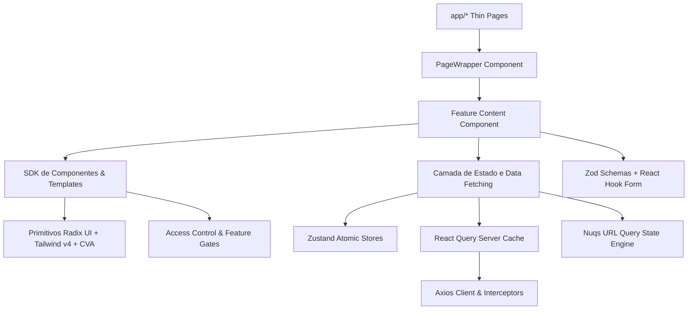
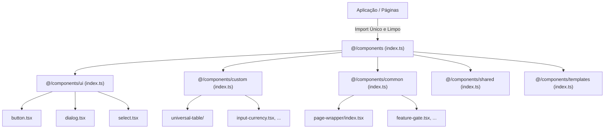
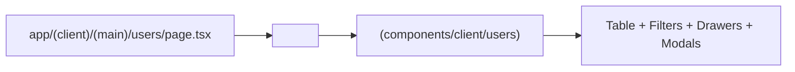
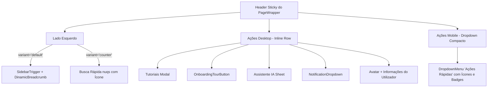
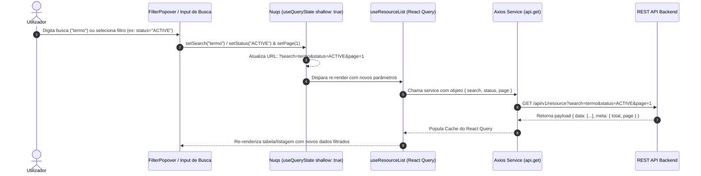
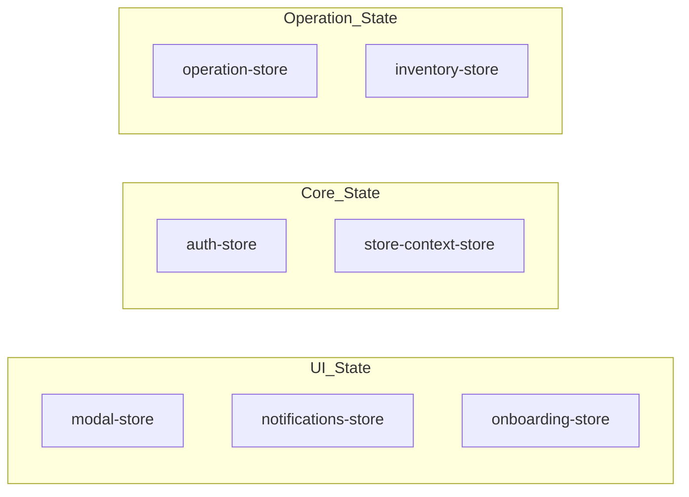
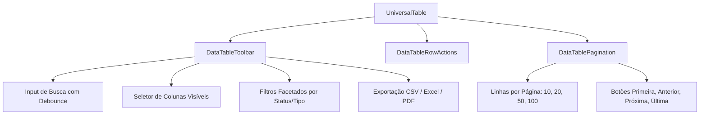
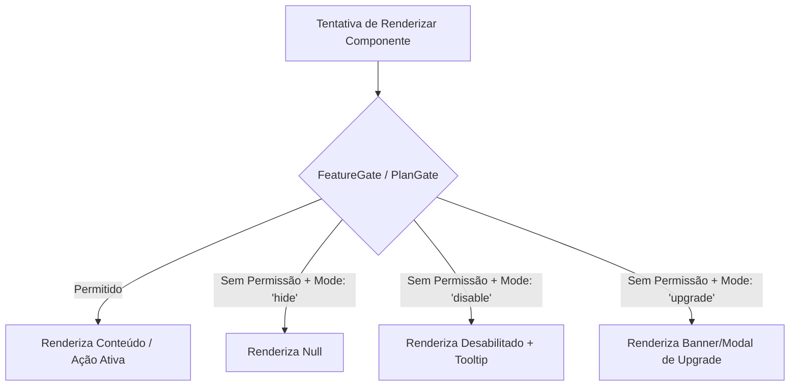
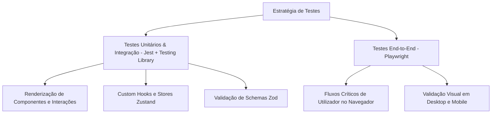

# 📦 MINDGEST Frontend SDK & Architecture Reference

> **Guia Oficial de Arquitetura, Design System, Padrões de Código e SDK de Componentes**  
> *Core Stack:* Next.js 16 (App Router) • React 19 • TypeScript 5  
> *Styling & Primitives:* Tailwind CSS v4 • Radix UI • Class Variance Authority (CVA)  
> *State & Data Fetching:* Zustand • TanStack React Query v5 • Axios • Nuqs  
> *Validation & Quality:* Zod • React Hook Form • Jest • Playwright  

---

## 📑 Índice

1. [Visão Geral e Arquitetura do SDK](#1-visão-geral-e-arquitetura-do-sdk)
2. [Estrutura do Projeto e Módulos do Core](#2-estrutura-do-projeto-e-módulos-do-core)
3. [Estratégia de Imports e Barrel Files (index.ts)](#3-estratégia-de-imports-e-barrel-files-indexts)
4. [Padrão de Organização das Páginas (Thin Pages Pattern)](#4-padrão-de-organização-das-páginas-thin-pages-pattern)
5. [O Componente Central: PageWrapper](#5-o-componente-central-pagewrapper)
6. [Mecanismo Completo de Filtros e Query Params](#6-mecanismo-completo-de-filtros-e-query-params)
   - 6.1 [Ciclo de Vida do Filtro: Da UI à API](#61-ciclo-de-vida-do-filtro-da-ui-à-api)
   - 6.2 [Sincronização na URL com Nuqs (`useQueryState`)](#62-sincronização-na-url-com-nuqs-usequerystate)
   - 6.3 [Componentes de Filtro: FilterPopover e DataTableToolbar](#63-componentes-de-filtro-filterpopover-e-datatabletoolbar)
   - 6.4 [Propagação para React Query e Serialização Axios](#64-propagação-para-react-query-e-serialização-axios)
7. [Camada de Provedores e Contextos Globais](#7-camada-de-provedores-e-contextos-globais)
8. [Cliente HTTP e Camada de Rede (Axios & React Query)](#8-cliente-http-e-camada-de-rede-axios--react-query)
9. [Gestão de Estado Global (Zustand Stores)](#9-gestão-de-estado-global-zustand-stores)
10. [Catálogo de Componentes e APIs do SDK](#10-catálogo-de-componentes-e-apis-do-sdk)
    - 10.1 [Primitivos de UI (`@/components/ui`)](#101-primitivos-de-ui-componentsui)
    - 10.2 [A Suíte Universal Table (`@/components/custom/universal-table`)](#102-a-suíte-universal-table-componentscustomuniversal-table)
    - 10.3 [Inputs Especializados e Formatados (`@/components/custom`)](#103-inputs-especializados-e-formatados-componentscustom)
    - 10.4 [Componentes Comuns e Utilitários de UI (`@/components/common`)](#104-componentes-comuns-e-utilitários-de-ui-componentscommon)
    - 10.5 [Guardas de Acesso e Controlo de Funcionalidades (`@/components/common` e `@/components/guards`)](#105-guardas-de-acesso-e-controlo-de-funcionalidades-componentscommon-e-componentsguards)
    - 10.6 [Templates de Layout e Navegação Global (`@/components/templates`)](#106-templates-de-layout-e-navegação-global-componentstemplates)
    - 10.7 [Visualização de Dados e Gráficos (`Recharts Wrapper`)](#107-visualização-de-dados-e-gráficos-recharts-wrapper)
    - 10.8 [Widgets Globais e Auxiliares (`@/components/shared`)](#108-widgets-globais-e-auxiliares-componentsshared)
11. [Camada de Validação e Formulários (Zod + React Hook Form)](#11-camada-de-validação-e-formulários-zod--react-hook-form)
12. [Utilitários e Helpers do Core (`@/utils` e `@/lib`)](#12-utilitários-e-helpers-do-core-utils-e-lib)
13. [Hooks Utilitários do SDK (`@/hooks`)](#13-hooks-utilitários-do-sdk-hooks)
14. [Estratégia de Testes e Qualidade (Jest & Playwright)](#14-estratégia-de-testes-e-qualidade-jest--playwright)
15. [Regras Principais de Refatoração e Padrões de Código](#15-regras-principais-de-refatoração-e-padrões-de-código)
16. [Convenções de Estilo, Tokens e Boas Práticas](#16-convenções-de-estilo-tokens-e-boas-práticas)

---

## 1. Visão Geral e Arquitetura do SDK

O frontend do **MINDGEST** foi concebido como uma biblioteca modular e desacoplada, disponibilizando um conjunto robusto de primitivos, hooks, stores e componentes de alto rendimento que funcionam como um **SDK corporativo universal**.



### Pilares de Design do SDK:
- **Composabilidade**: Componentes estruturados através de *Slot pattern* (`@radix-ui/react-slot`) e variantes CVA (`class-variance-authority`).
- **Desacoplamento e Universalidade**: Componentes agnósticos de domínio específico, desenhados para suportar qualquer produto, painel ou aplicação web moderna.
- **Tipagem Estrita**: 100% TypeScript com tipagem discriminada em tabelas, formulários, queries e respostas de API.
- **Acessibilidade e Desempenho**: Conformidade total com normas WAI-ARIA, suporte a temas e renderização otimizada.

---

## 2. Estrutura do Projeto e Módulos do Core

```text
src/
├── app/                  # Rotas do Next.js (App Router) - Thin Pages
│   ├── (client)/         # Contexto de aplicação autenticada
│   │   ├── (main)/       # Telas com navegação e sidebar global
│   │   ├── (fullscreen)/ # Rotas de ecrã inteiro e alta densidade
│   │   └── (public)/     # Vistas públicas de consulta e validação
│   └── auth/             # Fluxos de autenticação
├── components/
│   ├── index.ts          # Root Barrel File de Componentes
│   ├── ui/               # Primitivos visuais do Design System (Radix UI) + index.ts
│   ├── custom/           # Componentes avançados (Universal Table, Inputs Formatados) + index.ts
│   ├── common/           # Utilitários de UI (PageWrapper, Gates de Acesso, Modais) + index.ts
│   ├── guards/           # Componentes de guarda de rotas e ações protegidas + index.ts
│   ├── templates/        # Shell da aplicação: Sidebars, Headers e Navegação + index.ts
│   ├── shared/           # Widgets globais: Chatbot, Notificações, Tour + index.ts
│   └── modal/            # Controlos de modais e diálogos globais + index.ts
├── contexts/             # Contextos React (RouteProtector, Breadcrumb, Loader)
├── constants/            # Constantes de configuração, rotas, filtros e menus
├── hooks/                # Hooks customizados para UI e lógica de dados + index.ts
├── lib/                  # Configurações de bibliotecas (Tailwind merge, Axios, Session)
├── providers/            # Provedores de contexto React + index.ts
├── schemas/              # Schemas de validação de formulários (Zod) + index.ts
├── services/             # Clientes e abstrações de API HTTP + index.ts
├── stores/               # Stores atómicas de estado global (Zustand) + index.ts
├── types/                # Interfaces e tipos TypeScript partilhados + index.ts
└── utils/                # Utilitários puros de formatação e manipulação + index.ts
```

---

## 3. Estratégia de Imports e Barrel Files (`index.ts`)

Todo o SDK do frontend implementa o padrão arquitetural de **Barrel Files (Ficheiros de Re-exportação Centralizada via `index.ts`)**.



### 3.1 Como Funciona a Hierarquia de Re-exportação
Cada diretório encapsula os seus ficheiros internos e expõe apenas a interface pública através do seu `index.ts`:

1. **Root Components Barrel ([`src/components/index.ts`](file:///c:/Users/Administrator/Documents/GitHub/mindgest-frontend/src/components/index.ts))**:
```typescript
export * from "./ui";
export * from "./common";
export * from "./modal";
export * from "./templates";
export * from "./custom";
export * from "./auth";
export * from "./client";
export * from "./shared";
export * from "./guards";
```

2. **Sub-módulos Especializados ([`src/components/ui/index.ts`](file:///c:/Users/Administrator/Documents/GitHub/mindgest-frontend/src/components/ui/index.ts))**:
```typescript
export * from "./button";
export * from "./button-submit";
export * from "./dialog";
export * from "./dropdown-menu";
export * from "./input";
export * from "./select";
export * from "./table";
export * from "./sidebar";
// ...
```

3. **Hooks e Serviços ([`src/hooks/index.ts`](file:///c:/Users/Administrator/Documents/GitHub/mindgest-frontend/src/hooks/index.ts) e [`src/services/index.ts`](file:///c:/Users/Administrator/Documents/GitHub/mindgest-frontend/src/services/index.ts))**:
```typescript
export * from "./common";
export * from "./users";
export * from "./settings";
export * from "./notifications";
export * from "./use-mobile";
// ...
```

---

## 4. Padrão de Organização das Páginas (Thin Pages Pattern)

No ecossistema do frontend, os ficheiros `page.tsx` dentro do App Router atuam estritamente como **Entry Points Declarativos (Thin Pages)**.

### 🚫 Anti-Padrão (O que NÃO fazer no `page.tsx`):
- Declarar centenas de linhas de JSX diretamente no ficheiro da rota.
- Instanciar chamadas de API, múltiplos `useState`, `useEffect` e handlers complexos dentro de `page.tsx`.
- Misturar layout, header, paginação e modais num único ficheiro monolítico.

### ✅ Padrão Arquitetural Obrigatório:



```tsx
// Exemplo canónico de Thin Page:
import { UsersPageContent, PageWrapper } from "@/components";

export default function Page() {
  return (
    <PageWrapper subRoute="Utilizadores" onboardingTourId="users">
      <UsersPageContent />
    </PageWrapper>
  );
}
```

---

## 5. O Componente Central: PageWrapper

O [`PageWrapper`](file:///c:/Users/Administrator/Documents/GitHub/mindgest-frontend/src/components/common/page-wrapper/index.tsx) é o invólucro padrão obrigatório para todas as páginas da aplicação. Ele orquestra navegação, cabeçalho responsivo, breadcrumbs, atalhos de tour, busca rápida e ações globais.

### 5.1 Anatomia do Header do PageWrapper



### 5.2 Tabela de Propriedades (Props API)

| Prop | Tipo | Padrão | Descrição |
| :--- | :--- | :--- | :--- |
| `subRoute` | `string` | **Obrigatório** | Nome do segmento atual exibido no breadcrumb e no título da página. |
| `routePath` | `string` | `undefined` | URL da rota pai (ex: `"/management"`). |
| `routeLabel` | `string` | `undefined` | Rótulo legível da rota pai (ex: `"Gestão"`). |
| `variant` | `"default" \| "counter"` | `"default"` | Define o layout do cabeçalho: `"default"` (com breadcrumb) ou `"counter"` (com barra de pesquisa rápida integrada e layout de alta densidade). |
| `onboardingTourId` | `OnboardingTourId` | `undefined` | Identificador do tour guiado do `driver.js` para disparar o assistente da página. |
| `showSeparator` | `boolean` | `true` | Exibe o separador visual entre rota pai e sub-rota. |
| `children` | `React.ReactNode` | **Obrigatório** | Conteúdo da página envolvido num contentor responsivo com `@container/main`. |

---

## 6. Mecanismo Completo de Filtros e Query Params

Uma das maiores forças do frontend do MINDGEST é a sua **arquitetura de filtros reativa, bidirecional e sincronizada com a URL**.

### 6.1 Ciclo de Vida do Filtro: Da UI à API



---

### 6.2 Sincronização na URL com Nuqs (`useQueryState`)

A biblioteca **`nuqs`** gere o estado dos filtros diretamente nos search params do navegador. Isto garante que:
1. **Links são Partilháveis**: Qualquer utilizador pode copiar a URL e abrir exatamente a mesma visualização filtrada.
2. **Navegação Histórica (Back/Forward)**: O botão de voltar do navegador restaura o estado anterior dos filtros sem recarregar a página inteira (`shallow: true`).
3. **Reset de Paginação Inteligente**: Ao alterar uma busca ou filtro, a página atual é automaticamente reiniciada para `1`.

```tsx
import { useQueryState, parseAsInteger, parseAsString } from 'nuqs';

export function useEntityFilters() {
  const [search, setSearch] = useQueryState('search', parseAsString.withDefault('').withOptions({ shallow: true }));
  const [status, setStatus] = useQueryState('status', parseAsString.withDefault('ALL').withOptions({ shallow: true }));
  const [page, setPage] = useQueryState('page', parseAsInteger.withDefault(1).withOptions({ shallow: true }));
  const [limit, setLimit] = useQueryState('limit', parseAsInteger.withDefault(10).withOptions({ shallow: true }));
  const [sortBy, setSortBy] = useQueryState('sortBy', parseAsString.withDefault('createdAt').withOptions({ shallow: true }));
  const [sortOrder, setSortOrder] = useQueryState('sortOrder', parseAsString.withDefault('desc').withOptions({ shallow: true }));

  const handleSearchChange = (value: string) => {
    setSearch(value);
    setPage(1); // Sempre resetar para a primeira página
  };

  const handleStatusChange = (value: string) => {
    setStatus(value);
    setPage(1);
  };

  const handleResetFilters = () => {
    setSearch('');
    setStatus('ALL');
    setPage(1);
  };

  return {
    filters: { search, status, page, limit, sortBy, sortOrder },
    setSearch: handleSearchChange,
    setStatus: handleStatusChange,
    setPage,
    setLimit,
    setSortBy,
    setSortOrder,
    resetFilters: handleResetFilters,
  };
}
```

---

### 6.3 Componentes de Filtro: FilterPopover e DataTableToolbar

O SDK disponibiliza componentes prontos para acoplar aos query params:

#### 1. [`FilterPopover`](file:///c:/Users/Administrator/Documents/GitHub/mindgest-frontend/src/components/shared/filters/filter-popover.tsx) (`@/components/shared/filters`)
Componente compacto baseado em Radix Popover com checkboxes para seleção de filtros categóricos com badge indicativo de estado ativo:

```tsx
import { FilterPopover } from "@/components/shared/filters";

const statusOptions = [
  { value: "ACTIVE", label: "Ativo" },
  { value: "INACTIVE", label: "Inativo" },
];

export function TableFilterSection() {
  const { filters, setStatus } = useEntityFilters();

  return (
    <FilterPopover
      label="Estado"
      icon="Filter"
      options={statusOptions}
      value={filters.status === 'ALL' ? null : filters.status}
      onChange={(selected) => setStatus(selected ?? 'ALL')}
    />
  );
}
```

#### 2. [`DataTableToolbar`](file:///c:/Users/Administrator/Documents/GitHub/mindgest-frontend/src/components/custom/universal-table/data-table-toolbar.tsx) (`@/components/custom/universal-table`)
Barra de ferramentas unificada que integra busca rápida com debounce, múltiplos dropdowns facetados de colunas, toggle de visibilidade de colunas e ações de exportação em lote.

---

### 6.4 Propagação para React Query e Serialização Axios

Os parâmetros mantidos na URL são repassados de forma transparente para a chave da query e para a chamada HTTP do Axios:

```typescript
// 1. Hook de dados com React Query:
export function useFetchEntities(filters: EntityFilterParams) {
  return useQuery({
    queryKey: ['entities', filters], // Chave reativa baseada no objeto de filtros
    queryFn: async () => {
      const { data } = await api.get<PaginatedResponse<Entity>>('/entities', {
        params: filters, // Axios serializa para: /entities?search=...&status=...&page=...
      });
      return data;
    },
    placeholderData: (previousData) => previousData, // Mantém dados visíveis durante o fetch (sem layout shift)
  });
}
```

---

## 7. Camada de Provedores e Contextos Globais

A aplicação é envolvida por uma pilha de provedores modulares definidos em [`src/providers`](file:///c:/Users/Administrator/Documents/GitHub/mindgest-frontend/src/providers) e [`src/contexts`](file:///c:/Users/Administrator/Documents/GitHub/mindgest-frontend/src/contexts):

```tsx
// src/app/layout.tsx (Estrutura de Providers)
<ThemeProvider attribute="class" defaultTheme="system" enableSystem>
  <StoreProvider>
    <SessionProvider>
      <FeatureGateProvider>
        {children}
        <Toaster position="top-right" richColors />
      </FeatureGateProvider>
    </SessionProvider>
  </StoreProvider>
</ThemeProvider>
```

| Provider / Contexto | Ficheiro | Função |
| :--- | :--- | :--- |
| **`ThemeProvider`** | [`theme-provider.tsx`](file:///c:/Users/Administrator/Documents/GitHub/mindgest-frontend/src/providers/theme-provider.tsx) | Alternância de temas (Claro/Escuro/Sistema) via `next-themes`. |
| **`StoreProvider`** | [`store-provider.tsx`](file:///c:/Users/Administrator/Documents/GitHub/mindgest-frontend/src/providers/store-provider.tsx) | Hidratação e sincronização do contexto de unidade ou workspace ativa. |
| **`SessionProvider`** | [`session-provider.tsx`](file:///c:/Users/Administrator/Documents/GitHub/mindgest-frontend/src/providers/session-provider.tsx) | Ciclo de vida da sessão e persistência de autenticação. |
| **`FeatureGateProvider`** | [`feature-gate-provider.tsx`](file:///c:/Users/Administrator/Documents/GitHub/mindgest-frontend/src/providers/feature-gate-provider.tsx) | Contexto de controlo de permissões RBAC e flags ativas. |
| **`RouteProtector`** | [`route-protector.tsx`](file:///c:/Users/Administrator/Documents/GitHub/mindgest-frontend/src/contexts/route-protector.tsx) | Guarda de rotas declarativa baseada em lista de papéis (`allowed={['OWNER', 'ADMIN']}`). |
| **`useAccessControl`** | [`use-access-control.ts`](file:///c:/Users/Administrator/Documents/GitHub/mindgest-frontend/src/providers/use-access-control.ts) | Hook para validação declarativa de permissões no código. |

---

## 8. Cliente HTTP e Camada de Rede (Axios & React Query)

### 8.1 Cliente Base (`api.ts`)
Localizado em [`src/services/api.ts`](file:///c:/Users/Administrator/Documents/GitHub/mindgest-frontend/src/services/api.ts), disponibiliza uma instância centralizada do Axios com:
- **Interceptors de Requisição**: Injeção automática do Bearer JWT e cabeçalhos de contexto (`x-tenant-id`, `x-store-id`).
- **Interceptors de Resposta**: Tratamento unificado de erros (401, 403, 500), suporte a refresh token e notificação global via toasts Sonner.

```typescript
import axios from 'axios';

export const api = axios.create({
  baseURL: process.env.NEXT_PUBLIC_API_URL || 'http://localhost:3333',
  timeout: 30000,
  headers: {
    'Content-Type': 'application/json',
  },
});
```

---

## 9. Gestão de Estado Global (Zustand Stores)

As stores Zustand em [`src/stores`](file:///c:/Users/Administrator/Documents/GitHub/mindgest-frontend/src/stores) são concebidas como micro-estados atómicos, isolando domínios de execução:



### Estrutura Típica de Store do SDK
```typescript
import { create } from 'zustand';
import { persist, createJSONStorage } from 'zustand/middleware';

interface OperationItem {
  id: string;
  name: string;
  value: number;
  quantity: number;
}

interface OperationState {
  items: OperationItem[];
  addItem: (item: OperationItem) => void;
  removeItem: (id: string) => void;
  updateQuantity: (id: string, delta: number) => void;
  clear: () => void;
  total: () => number;
}

export const useOperationStore = create<OperationState>()(
  persist(
    (set, get) => ({
      items: [],
      addItem: (item) => set((state) => {
        const existing = state.items.find((i) => i.id === item.id);
        if (existing) {
          return {
            items: state.items.map((i) =>
              i.id === item.id ? { ...i, quantity: i.quantity + item.quantity } : i
            ),
          };
        }
        return { items: [...state.items, item] };
      }),
      removeItem: (id) => set((state) => ({ items: state.items.filter((i) => i.id !== id) })),
      updateQuantity: (id, delta) => set((state) => ({
        items: state.items
          .map((i) => (i.id === id ? { ...i, quantity: Math.max(0, i.quantity + delta) } : i))
          .filter((i) => i.quantity > 0),
      })),
      clear: () => set({ items: [] }),
      total: () => get().items.reduce((acc, i) => acc + i.value * i.quantity, 0),
    }),
    {
      name: '@mindgest/operation-storage',
      storage: createJSONStorage(() => localStorage),
    }
  )
);
```

---

## 10. Catálogo de Componentes e APIs do SDK

### 10.1 Primitivos de UI (`@/components/ui`)

Os 44 componentes base em [`src/components/ui`](file:///c:/Users/Administrator/Documents/GitHub/mindgest-frontend/src/components/ui) funcionam como base de estilo agnóstica:

| Componente | Ficheiro | Descrição Técnica |
| :--- | :--- | :--- |
| `Button` | [`button.tsx`](file:///c:/Users/Administrator/Documents/GitHub/mindgest-frontend/src/components/ui/button.tsx) | Botão com variantes CVA (`default`, `destructive`, `outline`, `secondary`, `ghost`, `link`), tamanhos (`sm`, `md`, `lg`, `icon`) e suporte a `asChild`. |
| `ButtonSubmit` | [`button-submit.tsx`](file:///c:/Users/Administrator/Documents/GitHub/mindgest-frontend/src/components/ui/button-submit.tsx) | Botão para submissão com estado de carregamento e spinner integrados. |
| `Dialog` | [`dialog.tsx`](file:///c:/Users/Administrator/Documents/GitHub/mindgest-frontend/src/components/ui/dialog.tsx) | Primitivo modal acessível baseado em Radix Dialog com backdrop escurecido e animações de entrada/saída. |
| `Drawer` | [`drawer.tsx`](file:///c:/Users/Administrator/Documents/GitHub/mindgest-frontend/src/components/ui/drawer.tsx) | Painel deslizante inferior/lateral baseado em `vaul` para dispositivos móveis ou ecrãs reduzidos. |
| `Sheet` | [`sheet.tsx`](file:///c:/Users/Administrator/Documents/GitHub/mindgest-frontend/src/components/ui/sheet.tsx) | Painel lateral deslizante (direita, esquerda, topo, fundo) para visualização e edição de detalhes. |
| `DropdownMenu` | [`dropdown-menu.tsx`](file:///c:/Users/Administrator/Documents/GitHub/mindgest-frontend/src/components/ui/dropdown-menu.tsx) | Menus de contexto, sub-menus, seletores de rádio e itens com atalhos de teclado. |
| `Select` | [`select.tsx`](file:///c:/Users/Administrator/Documents/GitHub/mindgest-frontend/src/components/ui/select.tsx) | Dropdown de seleção acessível com pesquisa e scroll suave. |
| `CalendarRAC` | [`calendar-rac.tsx`](file:///c:/Users/Administrator/Documents/GitHub/mindgest-frontend/src/components/ui/calendar-rac.tsx) | Calendário com suporte a React Aria Components para alta acessibilidade e navegação por teclado. |
| `Stepper` | [`stepper.tsx`](file:///c:/Users/Administrator/Documents/GitHub/mindgest-frontend/src/components/ui/stepper.tsx) | Componente de progresso em múltiplos passos (Wizards e fluxos guiados). |
| `Slider` | [`slider.tsx`](file:///c:/Users/Administrator/Documents/GitHub/mindgest-frontend/src/components/ui/slider.tsx) | Controlo deslizante contínuo com suporte a faixas numéricas. |
| `Skeleton` | [`skeleton.tsx`](file:///c:/Users/Administrator/Documents/GitHub/mindgest-frontend/src/components/ui/skeleton.tsx) | Indicador visual de carregamento com efeito shimmer. |
| `Badge` | [`badge.tsx`](file:///c:/Users/Administrator/Documents/GitHub/mindgest-frontend/src/components/ui/badge.tsx) | Etiquetas de estado e contadores com variantes temáticas. |

---

### 10.2 A Suíte Universal Table (`@/components/custom/universal-table`)

A **Universal Table** é a solução definitiva do SDK para renderização de grelhas de dados complexas:



#### Exemplo de Utilização:
```tsx
import { UniversalTable } from '@/components/custom/universal-table';
import { ColumnDef } from '@tanstack/react-table';

interface UserData {
  id: string;
  name: string;
  email: string;
  status: 'active' | 'inactive';
}

const columns: ColumnDef<UserData>[] = [
  { accessorKey: 'name', header: 'Nome' },
  { accessorKey: 'email', header: 'E-mail' },
  {
    accessorKey: 'status',
    header: 'Estado',
    cell: ({ row }) => <Badge variant={row.original.status === 'active' ? 'success' : 'secondary'}>{row.original.status}</Badge>,
  },
];

export function UsersList({ data }: { data: UserData[] }) {
  return (
    <UniversalTable
      columns={columns}
      data={data}
      searchKey="name"
      searchPlaceholder="Pesquisar por nome..."
      filterableColumns={[
        {
          id: 'status',
          title: 'Estado',
          options: [
            { label: 'Ativo', value: 'active' },
            { label: 'Inativo', value: 'inactive' },
          ],
        },
      ]}
    />
  );
}
```

---

### 10.3 Inputs Especializados e Formatados (`@/components/custom`)

Componentes controlados que tratam máscaras, formatos e validações visuais:

- [`input-currency.tsx`](file:///c:/Users/Administrator/Documents/GitHub/mindgest-frontend/src/components/custom/input-currency.tsx): Formatação monetária e numérica com separadores decimais e de milhares personalizáveis.
- [`price-input.tsx`](file:///c:/Users/Administrator/Documents/GitHub/mindgest-frontend/src/components/custom/price-input.tsx): Input numérico de precisão para valores unitários e taxas.
- [`perc-input.tsx`](file:///c:/Users/Administrator/Documents/GitHub/mindgest-frontend/src/components/custom/perc-input.tsx): Input para percentagens com limites configuráveis (0 a 100).
- [`date-picker-input.tsx`](file:///c:/Users/Administrator/Documents/GitHub/mindgest-frontend/src/components/custom/date-picker-input.tsx): Campo de seleção de data com popover acoplado e suporte a internacionalização.
- [`time-input.tsx`](file:///c:/Users/Administrator/Documents/GitHub/mindgest-frontend/src/components/custom/time-input.tsx): Input para seleção e introdução de horários com máscara.
- [`valid-input-password.tsx`](file:///c:/Users/Administrator/Documents/GitHub/mindgest-frontend/src/components/custom/valid-input-password.tsx): Input de palavra-passe com indicador visual de força criptográfica e validação de critérios (maiúsculas, símbolos, números, tamanho).
- [`multi-select-input.tsx`](file:///c:/Users/Administrator/Documents/GitHub/mindgest-frontend/src/components/custom/multi-select-input.tsx): Seleção de múltiplos valores com chips/tags removíveis.

---

### 10.4 Componentes Comuns e Utilitários de UI (`@/components/common`)

Componentes transversais para padronizar telas de visualização, formulários e respostas do sistema:

- **`empty-state/`**: Componente visual para quando uma listagem ou consulta não retorna registos (com ilustração, título, mensagem explicativa e botão de ação primária).
- **`alert-error/`** e **`request-error/`**: Componentes para exibição elegante de falhas de comunicação, erros de validação ou exceções da API.
- **`detail-row/`**: Linha estruturada com rótulo em mute e valor em destaque para ecrãs de detalhes e auditoria.
- **`title-list/`**: Cabeçalho de secção com título, subtítulo e grupo de botões de ação à direita.
- **`dynamic-drawer/`**: Gaveta lateral polimórfica para formulários secundários de criação e edição rápida.
- **`file-upload/`** e **`photo-upload/`**: Componentes de upload de ficheiros e imagens com suporte a Drag & Drop via `react-dropzone` e pré-visualização.
- **`skeletons/`**: Conjunto de placeholders animados pré-configurados por layout (tabela, cartões, formulário).

---

### 10.5 Guardas de Acesso e Controlo de Funcionalidades (`@/components/common` e `@/components/guards`)

Permitem proteger componentes visualmente e por comportamento de acordo com permissões ou planos:



#### Assinatura de `FeatureGate`:
```tsx
import { FeatureGate } from '@/components/common/feature-gate';

export function AdvancedExportButton() {
  return (
    <FeatureGate
      feature="advanced-exports"
      fallbackMode="disable"
      disabledTooltip="Esta funcionalidade requer privilégios elevados"
    >
      <Button onClick={handleExport}>Exportar Relatório Avançado</Button>
    </FeatureGate>
  );
}
```

---

### 10.6 Templates de Layout e Navegação Global (`@/components/templates`)

A estrutura de casca da aplicação é fornecida pelo módulo [`src/components/templates/global-sidebar`](file:///c:/Users/Administrator/Documents/GitHub/mindgest-frontend/src/components/templates/global-sidebar):

- [`app-sidebar.tsx`](file:///c:/Users/Administrator/Documents/GitHub/mindgest-frontend/src/components/templates/global-sidebar/app-sidebar.tsx): Barra lateral responsiva e colapsável com controlo de estado via teclado (`Ctrl + B`).
- [`nav-components.tsx`](file:///c:/Users/Administrator/Documents/GitHub/mindgest-frontend/src/components/templates/global-sidebar/nav-components.tsx): Lista de navegação em árvore com suporte a itens agrupados, badges e ícones dinâmicos.
- [`sidebar-info.tsx`](file:///c:/Users/Administrator/Documents/GitHub/mindgest-frontend/src/components/templates/global-sidebar/sidebar-info.tsx): Seletor de contexto (workspace / organização ativa).
- [`user-info.tsx`](file:///c:/Users/Administrator/Documents/GitHub/mindgest-frontend/src/components/templates/global-sidebar/user-info.tsx): Cartão do utilizador com avatar, perfil, popover de ações rápidas e logout.

---

### 10.7 Visualização de Dados e Gráficos (`Recharts Wrapper`)

Abstrações prontas para uso em dashboards e cartões de KPI:

- [`chart.tsx`](file:///c:/Users/Administrator/Documents/GitHub/mindgest-frontend/src/components/ui/chart.tsx): Contentor com suporte a variáveis CSS para paleta de cores automática em Light/Dark mode.
- [`chart-area-interactive.tsx`](file:///c:/Users/Administrator/Documents/GitHub/mindgest-frontend/src/components/custom/chart-area-interactive.tsx): Gráfico de área temporal com seletor de janelas de tempo (7d, 30d, 90d, 1 ano).
- [`dynamic-metric-card.tsx`](file:///c:/Users/Administrator/Documents/GitHub/mindgest-frontend/src/components/shared/dynamic-metric-card.tsx): Cartão de KPI com valor principal, subtítulo, ícone e indicador de tendência (`metric-trend.tsx`).

---

### 10.8 Widgets Globais e Auxiliares (`@/components/shared`)

- **Chatbot Widget (`shared/chatbot`)**: Janela flutuante conversacional para assistência contextual.
- **Central de Notificações (`shared/notifications`)**: Dropdown com suporte a mensagens em tempo real via WebSockets (`socket.io-client`).
- **Onboarding Assistido (`shared/tutorials` & `onboarding-tour-button.tsx`)**: Motor de tour interativo baseado em `driver.js` para destacar elementos da interface passo-a-passo.
- **PWA Register (`shared/pwa-service-worker-register.tsx`)**: Registo automático do Service Worker para suporte a Progressive Web App.

---

## 11. Camada de Validação e Formulários (Zod + React Hook Form)

Localizada em [`src/schemas`](file:///c:/Users/Administrator/Documents/GitHub/mindgest-frontend/src/schemas), padroniza todos os contratos de dados dos formulários:

```typescript
// Exemplo de Schema Zod em src/schemas/
import { z } from 'zod';

export const userProfileSchema = z.object({
  name: z.string().min(3, 'O nome deve ter no mínimo 3 caracteres'),
  email: z.string().email('E-mail inválido'),
  role: z.enum(['ADMIN', 'MANAGER', 'USER']),
});

export type UserProfileFormData = z.infer<typeof userProfileSchema>;
```

### Integração com `react-hook-form`:
```tsx
import { useForm } from 'react-hook-form';
import { zodResolver } from '@hookform/resolvers/zod';
import { userProfileSchema, UserProfileFormData } from '@/schemas';

export function EditProfileForm() {
  const {
    register,
    handleSubmit,
    formState: { errors, isSubmitting },
  } = useForm<UserProfileFormData>({
    resolver: zodResolver(userProfileSchema),
  });

  const onSubmit = async (data: UserProfileFormData) => {
    // Submissão tipada
  };

  return <form onSubmit={handleSubmit(onSubmit)}>{/* Campos */}</form>;
}
```

---

## 12. Utilitários e Helpers do Core (`@/utils` e `@/lib`)

A pasta [`src/utils`](file:///c:/Users/Administrator/Documents/GitHub/mindgest-frontend/src/utils) contém funções utilitárias puras, testadas e reutilizáveis:

| Função / Módulo | Ficheiro | Descrição |
| :--- | :--- | :--- |
| `formatCurrency(val, currency?)` | [`format-currency.ts`](file:///c:/Users/Administrator/Documents/GitHub/mindgest-frontend/src/utils/format-currency.ts) | Formata valores numéricos com separador de milhares e símbolo monetário. |
| `formatDate(date, pattern?)` | [`format-date.ts`](file:///c:/Users/Administrator/Documents/GitHub/mindgest-frontend/src/utils/format-date.ts) | Formata datas e horários via `date-fns` com suporte a localização. |
| `formatPrice(val)` | [`format-price.ts`](file:///c:/Users/Administrator/Documents/GitHub/mindgest-frontend/src/utils/format-price.ts) | Formatação de precisão numérica sem casas decimais redundantes. |
| `downloadFile(blob, filename)` | [`donwload.file.ts`](file:///c:/Users/Administrator/Documents/GitHub/mindgest-frontend/src/utils/donwload.file.ts) | Dispara o download programático de ficheiros (PDF, CSV, Excel, Imagens). |
| `errorHandler(error)` | [`error-handler.ts`](file:///c:/Users/Administrator/Documents/GitHub/mindgest-frontend/src/utils/error-handler.ts) | Normaliza exceções HTTP e mensagens de erro para exibição nos toasts. |
| `playAudioFeedback(type)` | [`audio.ts`](file:///c:/Users/Administrator/Documents/GitHub/mindgest-frontend/src/utils/audio.ts) | Emite feedback sonoro para operações de sucesso, aviso ou erro em fluxos rápidos. |

---

## 13. Hooks Utilitários do SDK (`@/hooks`)

| Hook | Ficheiro | Descrição e Utilização |
| :--- | :--- | :--- |
| `useMobile` | [`use-mobile.ts`](file:///c:/Users/Administrator/Documents/GitHub/mindgest-frontend/src/hooks/use-mobile.ts) | Deteta via matchMedia se o ecrã atual é inferior a 768px (breakpoint móvel). |
| `useSliderWithInput` | [`use-slider-with-input.ts`](file:///c:/Users/Administrator/Documents/GitHub/mindgest-frontend/src/hooks/use-slider-with-input.ts) | Sincroniza bidirecionalmente um controlo deslizante e um input numérico com limites. |
| `useDebounce` | `use-debounce` (lib) | Atraso configurável na emissão de valores para buscas em tempo real sem sobrecarga de rede. |

---

## 14. Estratégia de Testes e Qualidade (Jest & Playwright)

O ecossistema possui uma suíte dupla de testes automatizados:



### Comandos de Teste no `package.json`:
- `pnpm test`: Executa os testes unitários com Jest.
- `pnpm test:watch`: Executa Jest em modo contínuo de observação.
- `pnpm test:coverage`: Gera relatório detalhado de cobertura de código.
- `pnpm test:e2e`: Executa a bateria de testes End-to-End no Playwright em modo headless.
- `pnpm test:e2e:ui`: Abre a interface gráfica interativa do Playwright para depuração de fluxos.

---

## 15. Regras Principais de Refatoração e Padrões de Código

Para manter a consistência, manutenibilidade e alta velocidade de entrega da equipa, qualquer refatoração no frontend deve seguir estritamente as seguintes **8 Regras de Ouro**:

```mermaid
graph TD
    R1["1. Thin Pages / Fat Components"]
    R2["2. Separação de Camadas (No Raw Axios in UI)"]
    R3["3. Reutilização de Tabelas (Universal Table)"]
    R4["4. Formulários Tipados (Zod + Custom Inputs)"]
    R5["5. Controle de Acesso Declarativo (Gates)"]
    R6["6. Mobile-First & Container Queries"]
    R7["7. Modais Desacoplados (Modal Store/Drawers)"]
    R8["8. Imports via Barrel Files (index.ts)"]
```



### Regra 1: Thin Pages & Fat Feature Components
- **Princípio**: Todo o `app/**/page.tsx` deve ter menos de 20 linhas de código.
- **Implementação**: A página apenas importa o `PageWrapper` e delega a composição para o respetivo `*PageContent` localizado em `components/client/<modulo>/`.

### Regra 2: Isolamento da Camada de Rede (Sem Axios Direto na UI)
- **Princípio**: Nenhum componente React deve executar chamadas `axios.get()` ou `fetch()` diretamente.
- **Implementação**:
  1. Definir o contrato de API em `services/<modulo>-service.ts`.
  2. Criar o custom hook React Query correspondente em `hooks/<modulo>/use-<acao>.ts`.
  3. Consumir apenas o hook dentro do componente visual.

### Regra 3: DRY na Renderização de Listagens (Universal Table Obrigatória)
- **Princípio**: Proibido escrever estruturas repetitivas de `<table>`, `<thead>` ou paginações manuais em páginas de listagem.
- **Implementação**: Utilizar sempre o `<UniversalTable />`, configurando as colunas via `ColumnDef<T>`, filtros facetados e ações de linha centralizadas.

### Regra 4: Formulários com Validação Estrita (Zod + Custom Inputs)
- **Princípio**: Todo o formulário com mais de 2 campos deve utilizar `react-hook-form` com schema `zod`.
- **Implementação**: Utilizar os inputs formatados do SDK (`<InputCurrency />`, `<PriceInput />`, `<DatePickerInput />`) para garantir máscaras e tipagens consistentes.

### Regra 5: Guardas de Acesso Declarativas (Eliminar `if (role === ...)` no JSX)
- **Princípio**: Evitar condicionais manuais de perfil ou plano espalhadas pelo JSX.
- **Implementação**: Envolver botões e secções restritas com `<FeatureGate>` ou `<ProtectedAction>`, garantindo feedback visual consistente (tooltips, modais de upgrade ou desativação).

### Regra 6: Responsividade com `@container` e `useMobile`
- **Princípio**: Telas devem ser construídas considerando monitores widescreen (desktop), tablets, terminais touch e mobile.
- **Implementação**: O `PageWrapper` já fornece `@container/main`. Utilize classes de container query (ex: `@md:grid-cols-2`, `@xl:grid-cols-4`) em vez de depender exclusivamente dos breakpoints da janela global.

### Regra 7: Desacoplamento de Modais e Drawers
- **Princípio**: Não embutir múltiplos modais pesados no corpo principal das páginas.
- **Implementação**: Para formulários secundários e detalhes rápidos, priorizar o `<DynamicDrawer />` ou acionar diálogos através da `modal-store`.

### Regra 8: Consumo e Exportação através de Barrel Files (`index.ts`)
- **Princípio**: Proibido realizar imports com caminhos relativos profundos ou importar diretamente ficheiros internos de uma pasta quando ela disponibiliza um `index.ts`.
- **Implementação**: Sempre exportar novos componentes, hooks ou serviços no `index.ts` correspondente e consumi-los através dos aliases principais (`@/components`, `@/components/ui`, `@/hooks`, `@/services`, `@/stores`, `@/utils`).

---

## 16. Convenções de Estilo, Tokens e Boas Práticas

### 16.1 Tailwind CSS v4 e Variáveis CSS
As variáveis de cor e espaçamento são configuradas em [`src/app/globals.css`](file:///c:/Users/Administrator/Documents/GitHub/mindgest-frontend/src/app/globals.css):
- Paleta semântica: `--background`, `--foreground`, `--primary`, `--primary-foreground`, `--muted`, `--accent`, `--border`, `--ring`.
- Utilização estrita do utilitário `cn()` (`clsx` + `tailwind-merge`) para merge de classes:

```typescript
import { clsx, type ClassValue } from 'clsx';
import { twMerge } from 'tailwind-merge';

export function cn(...inputs: ClassValue[]) {
  return twMerge(clsx(inputs));
}
```

### 16.2 Regras de Criação de Novos Componentes no SDK
1. **Separar Componentes Base de Lógica de Negócio**: Novos componentes atómicos devem residir em `components/ui/` ou `components/custom/` e aceitar dados via `props` puras.
2. **Exportação Centralizada**: Todos os componentes devem ser exportados através do ficheiro `index.ts` do respetivo diretório.
3. **Acessibilidade Obrigatória**: Elementos interativos devem incluir rótulos `aria-label`, foco visível (`focus-visible:ring`) e suporte a navegação por teclado.
